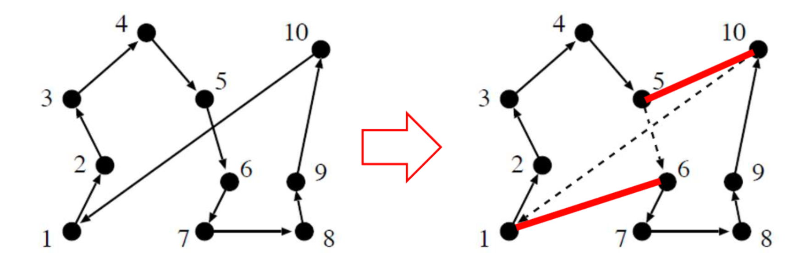
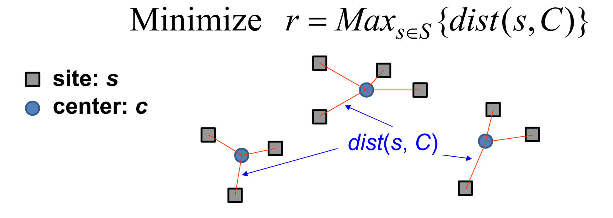
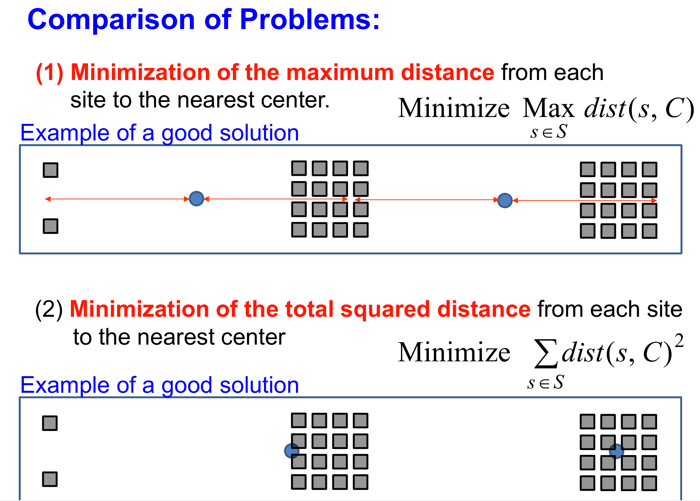
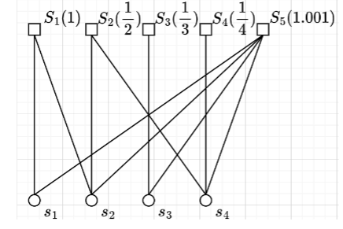
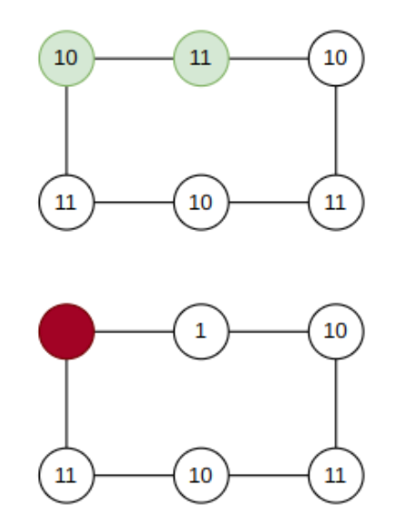
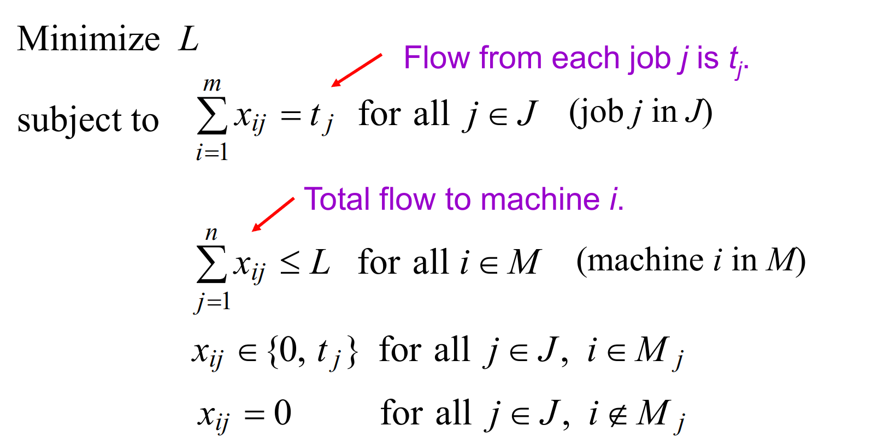
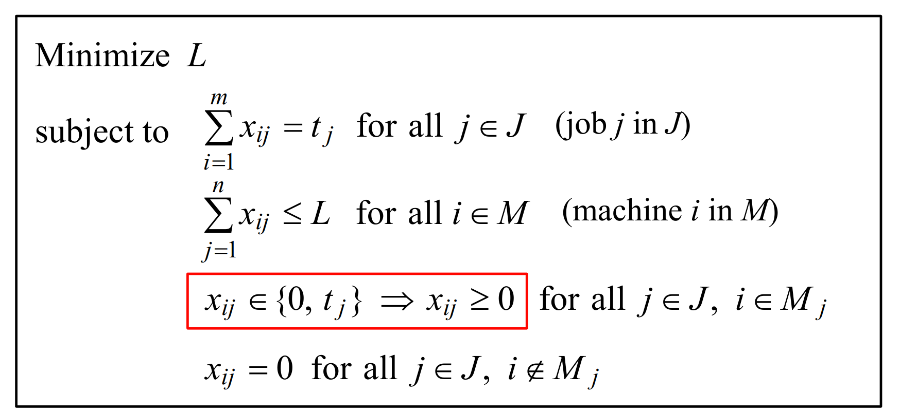
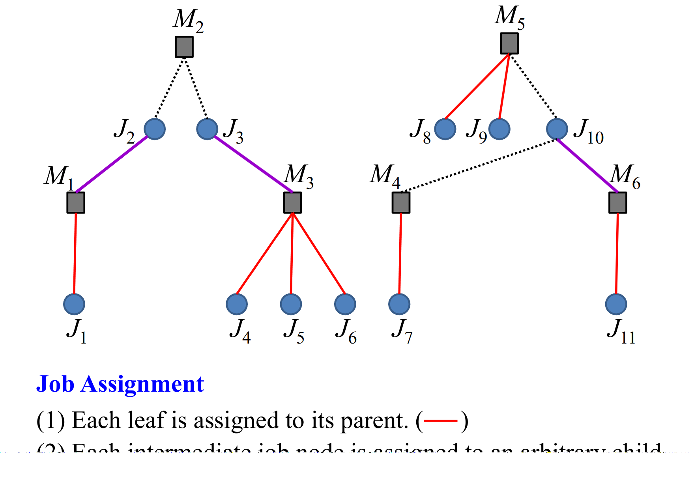
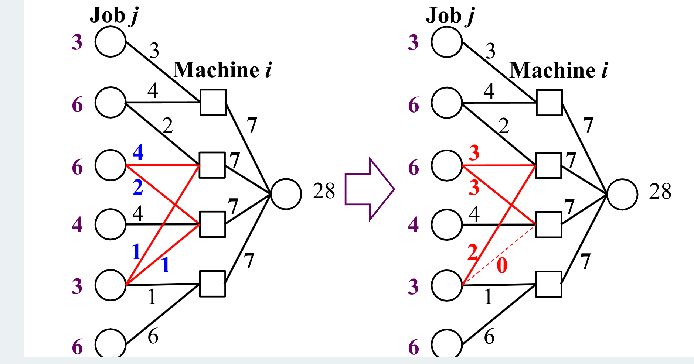

## Lecture 1: 

优化问题的分类：

1. 是否总是能获得最优的解？
   - 是：Exact Optimization Algorithms（精确优化算法）线性规划，动态规划
   - 否：Approximation Algorithms（近似算法）贪心，遗传

2. 决策变量连续还是离散？

   - Continuous Optimization 连续优化问题：线性规划

   - Discrete (Combinatorial) Optimization 离散优化问题：整数规划

   - Mixture 1,2的混合

3. 目标函数的数量

   - 单目标优化

   - 多目标优化

4. 目标值的类型

   - 目标值是精确值：标准优化问题
   - 目标值带有一定不确定性：区间编程，随机规划，模糊编程。。。

5. 有无约束条件：

   - 有约束优化 （LP，背包，几乎所有现实世界的问题）
   - 无约束优化 （TSP）

## Lecture 2: TSP Problem

**Input**: City set and distance between each pair of cities

**Objecttive**: Minimization of a tour length starting from a city,
visiting all cities and returning to the start city

解决方案质量（Solution Quality Index）$ = \frac{\text{Tour Length}}{\text{Optimal Tour Length}}$

### Greedy:  

随意选择一个城市后，每次前往最近的那个城市。

**Note：** 如果一个旅行有交叉点，则该旅行不是最优的。

### Best Move Local Search

检查通过对当前解应用一次反转操作生成的所有邻居。然后用所有邻居中最好的解替换当前解（如果最好的解优于当前解）。如果最好的解不优于当前解，则终止局部搜索的迭代。

从$n$条边中进行依次反转操作可能产生$\frac{n(n-1)}{2}$个解。

## Lecture 3&4: Load Balancing Problem

- Input: = $m$ identical machines: $M1, M2, ..., Mm$

  $n$ jobs: $J1, J2, ..., Jn$

  Processing Time of each jobL $t_j(j=1, 2, ..., n)$

- Question: What is the best assignment with the minimum makespan?

### Greedy

将工作分配给负载最小的机器，按照任意顺序进行作业。

2-approximation (二近似)

当工作数量与机器数量相同或少于机器数量时，该算法获得最优

最差结果出现在 **最长的任务**被**最后分配**的情况（例如：5, 5, 10分配给两台机器，贪心最差解为15，即先分配两个5给两台机器，最后分配10）

### Sorted Greedy Algorithm

将作业分配给负载最小的机器，按照作业的降序排列（最长的作业优先）

3/2-Approximation Algorithm （1.5近似）(其实应该是4/3-approximation)

最差情况出现在n足够小时，最短的作业时长接近$\frac{T^*}{2}$  （其实应该是$\frac{T^*}{3}$），因为想要出现一台机器负载多个任务且计算该问题有意义的情况下，m一定大于1。

### General Settings of Load Balancing （可能出现的general setting变种）

1. Some machines can process only a part (i.e., subset) of jobs.

2. Each job appears at different time

## Lecture 5&6: Center Selection Problem

- Input: $n$ cities $S={s_1, s_2, ..., s_n}$ 
- Output: Location of $k$ centers: $C={c_1, c_2, ..., c_k}$
- Objective: Minimize the maximum distance from each
  site to the nearest center. (最小化中心点到城市的最大距离)

两种情况：

1. 对中心点位置没有约束
2. 中心点必须在集合 $S$ 中 

一个**虚拟的**中心选择算法 (2-approximation)：

- 选择距离最优解的一个中心距离$r^*$范围的一个随机点，删除所有距离为$2r^*$的点
- 重复上个过程直到没有点 

能够工作的原因：能保证所有的点至少有一个距离为$2r^*$的点在其附近。

### Greedy inclusion algorithm

在每一步迭代中，选择一个能够最小化**将其添加到中心集合后**每个站点到最近中心的最大距离

每次迭代都至少有两个价值的点，需要从中随机选择一个继续。

## Lecture 7: Clusting

- Input: $n$ cities $S={s_1, s_2, ..., s_n}$ 
- Output: Location of $k$ centers: $C={c_1, c_2, ..., c_k}$
- Objective: Minimize the total square distance from each
  site to the nearest center. (最小化中心点到城市的最大距离)

与Center Selection算法的区别：

### K-Means （not an exact algorithm）

Objective: 最小化每个站点到最近中心的**总平方距离**

Steps:

1. 取当前簇的算术平均值作为簇的中心
2. 依靠距离簇中心的距离将点划分给簇
3. 重新计算簇中心
4. 重复以上过程直到收敛

### k-medoids 

类似K-Means， 但在第一步中在簇中选择一个到所有其他站点的总距离最小的点。

### Fuzzy c-means

## Lecture 8: Set Cover

- Input: $n$ jobs ${s_1, s_2, ..., s_n}$
- $m$ machines, where
  - Each machine have a price $w_1, w_2, ..., w_n$
  - Each machine can handle a subset $S_j$ in the $n$ jobs

Objective: Choise machines to minimize the cost.
$$
\text{Minimize }w(C)=\sum_{S_i \in C}\text{ subject to }\bigcup_{S_i \in C} S_i = U
$$

### Greedy

选择目前完成任务平均cost最小的机器 

例如机器A在目前剩余的四个任务中能够解决三个，cost为6，那平均cost为 $6 / 3 = 2$

最坏结果：$w\leq H(max_k|S_k|)w^*$ , where $H(n)=\frac{1}{1}+\frac{1}{2}+\frac{1}{3}+...+\frac{1}{n}$

最坏结果出现在每次最优解集都刚好差一点点被选择（如下面的$S_5$）

## Lecture 9: Vertex Cover Problem

- Input: Graph $G$: $G=(V, E)$

  Weight of each vertex (node): $w_i(i\in V)$

- Output: Vertex cover $S$ can cover every edge in $G$ with minimum weight.

Can be modeled with set cover problem.

### Pricing Method: 2-approximation

设 $p$ 为边 $e$ 愿意支付的覆盖费用。所有与顶点 $v$ 相连的边的价格总和应小于或等于 $w$.

Process: 随机选择一条边，增长该边的价格直到与之相连的一条边tight.

差解出现在权重较大的边被边的价格消耗，从而先于权重较小的边被选择。

## Lecture 10&11： Vertex Cover Problem - Use of LP（ 2-approximation）

Vertex Cover 的整数规划(Integer Programming)形式表达：
$$
\text{Minimize } w_{IP}(x)=\sum_{i\in V}w_ix_i \\
\text{Subject to } Ax \geq 1\\
x\in \{0, 1\}\text{ for }i\in V
$$
**Matrix A**: Rows of A correspond to edges in E
Columns of A correspond to vertexes in V

线性规划：寻找一条线在一个空间中的最值

Relaxation Problem: 对于一个整数规划问题，其线性规划问题是一个松弛解

整数规划问题的全局最优解不会超过其松弛解，同时也不会差于贪心算法的解

## Lecture 12: Generalized Load Balancing Problem(Use of LP)

**Input:** Set of $m$ machines: $M = \{\text{Machine 1}, ..., \text{Machine m}\}$
	Set of $n$ jobs: $J = \{\text{Job 1}, ..., \text{Job n}\}$
	Processing time of each job: $t_j (j = 1, 2, ..., n)$
	Subset of M for each job: $M_j (j = 1, 2, ..., n)$
**Constraint:** Job $j$ should be assigned to a machine in $M_j$
**Objective:** Minimization of the makespan
**Output:** Assignment of $n$ jobs to m machines

### 整数规划建模

### 线性规划建模

### Question: How to obtain a feasible solution from the obtained solution of the relaxation problem?

(1) 每个叶子节点被分配给其父节点。

(2) 每个中间作业节点被分配给一个任意的子节点。

### Question: How to eliminate cycles from the obtained graph?

选择一个循环。沿着循环改变每条边的流量，而不改变每个节点的总输入和每个节点的总输出（即，不改变目标值 L）。

## Lecture 13: Disjoint Paths Problem

Greedy: 选择最短路径（$2\sqrt{m}+1$ approximation）

## Lecture 14: Knapback Problem

### Greedy Algorithm

Choose the item with the largest value per unit weight.

If the total weight of the selected items is the same as the weight
capacity W with no item skip, the greedy solution is the optimal
solution.
