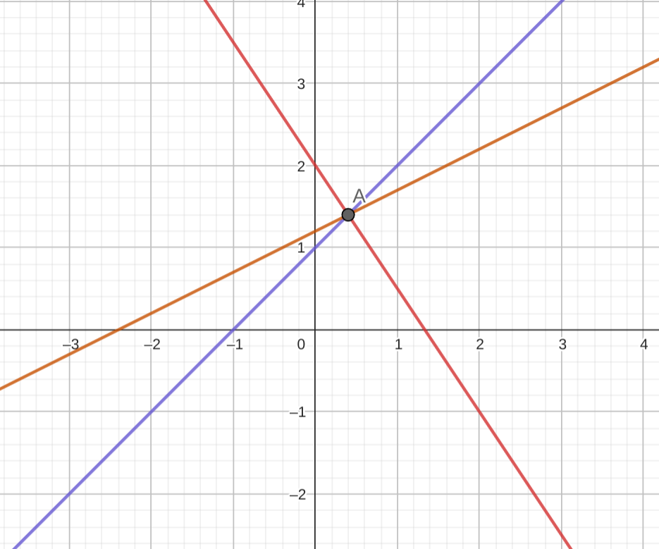

# Assignment10 : Vertex Cover Problem
- Zitong Huang, 12432670, Computer Science and Engineering
- Scene Reconstruction
- Prof. Feng Zheng

---
layout: two-cols
---

# Task 10-1

$$
\text{Target: } \max Z = \mathbf{c}^T \mathbf{x} = [1,\ -4] \begin{bmatrix} x_1 \\ x_2 \end{bmatrix}
$$

$$
\text{Subject to: } 
\begin{bmatrix} 
3 & 2 \\ 
-1 & 1

\end{bmatrix}
\begin{bmatrix} 
x_1 \\ 
x_2 
\end{bmatrix}
\leq 
\begin{bmatrix} 
7 \\ 
2  
\end{bmatrix},\quad x_1, x_2 \geq 0
$$

::right::

    

