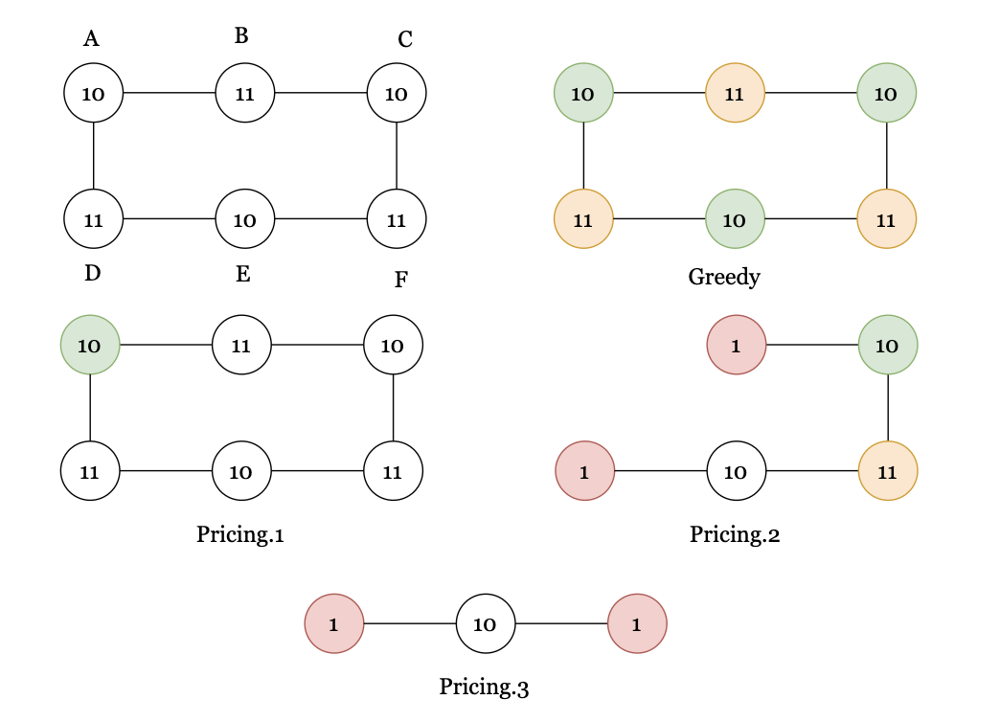
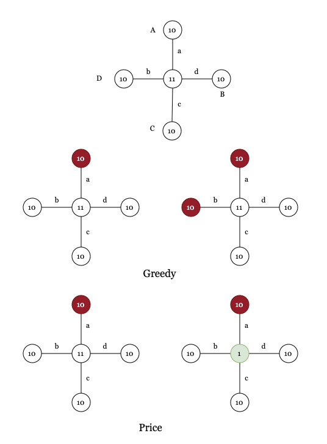

# Assignment11 : Vertex Cover Problem
- Zitong Huang, 12432670, Computer Science and Engineering
- Scene Reconstruction
- Prof. Feng Zheng

---
layout: two-cols
---

## Task 11-1

As shown right:

For greedy algorithm, Greedy will select A, C, E first, since they are the smaller one in every edge.

For pricing Algorithm, after choose **two** vertices(for pricing algorithm's best solution **on 2nd choose**), the only remaining bertex will be D, E and F. Both of them are smaller than E.

For Linear Programing, the solution will be $[0.5, 0.5, 0.5, 0.5, 0.5, 0.5]^T$

::right::
  
  
  

---
layout: two-cols
---

## Task 11-2

As shown right:

Greedy will select A, B, C, D, then the center

Pricing will choose one of A, B, C, D, then the center, no matter the order how edges are chosen.

As for LP, the solution will be $[0.5, 0.5, 0.5, 0.5, 0.5]^T$

::right::

---
layout: two-cols
---

## Task 11-3

As shown right:

Greedy will select A, B, C, D first, then the center

Pricing will choose one of A, B, C, D, then the center, no matter the order how edges are chosen.

As for LP, the solution will be $[1 - t, t, t, t, t]^T$, so we have

$$
w = 2.0833t + 1.001(1 - t),t \in {0, 1}
$$

where $w$ will be 1.001

::right::
