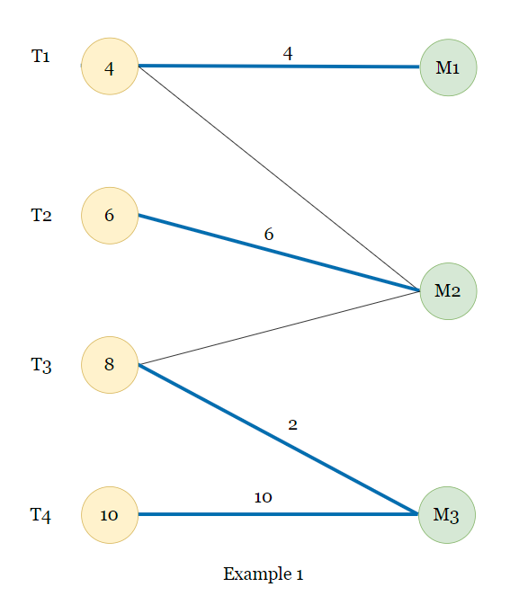

# Assignment12 : General Load Balancing Problem
- Zitong Huang, 12432670, Computer Science and Engineering
- Scene Reconstruction
- Prof. Feng Zheng

---
layout: two-cols
---
## Task 12-1

| Package      | Algorithm  |
|----------------|--------|
|Scipy|   HiGHS$^{[1]}$   |
|Scipy|   Simplex$^{[2]}$ |

::right::
  

>[1] Huangfu, Q., & Hall,  J. J. (2018). Parallelizing  the dual revised  simplex method. Mathematical  Programming  Computation,  10(1), 119-142.
>
>[2] Dantzig, G. B. (1948). Programming in a linear structure. Econometrica, 17(1), 73–74.

