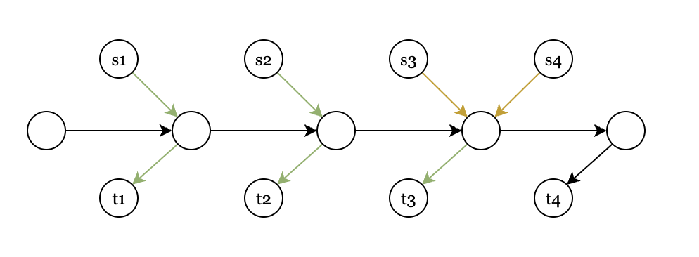

# Assignment13: Disjoint Paths Problem 
- Zitong Huang, 12432670, Computer Science and Engineering
- Scene Reconstruction
- Prof. Feng Zheng

---

## Task 13-1: Example 1

  

- Green edge will be choosen by algo. As for yellow edge, regardless of which edge is chosen by the algorithm, the final result will not change (will be 4).

    

---
layout: two-cols
---

## Task 13-1: Example 2

  

As shown right, $m=9$ the optimal solution is 3. However, because of the greedy algo choose ${s2, t2}$, the other pairs are blocked, result comes to 1.

Since that, we have
$$
\frac{|I^*|}{|I|} = 3 = \sqrt{m}
$$

Which match the required $|I^*| \leq \sqrt{m} \space |I|$
::right::

    
    Example 1

    
    Example 2

---
layout: two-cols
---

## Task 13-1: Example 3

  

As shown right, $m=14$.

Optimal Solution $I^* = \{s1, t1\}, \{s2, t2\}, \{s3, t3\}, \{s4, t4\}$, $|I^*| = 4$.

However, greedy algo will choose $\{s2, t2\}$ which will block the other pairs, result comes to 1.

The ratio is $\frac{|I^*|}{|I|} = 4 > \sqrt{m}$, which match the required $|I^*| > \sqrt{m} \space |I|$

::right::

    
    Example 3

    
    Example 4

---
layout: two-cols
---
## Task 13-2 Example 1: 
  

- **Start-Target Pair(c=2)**

1. $(A \to D)$: uses the path $A - B - C - D$.  
2. $(A \to B)$: uses the edge $(A - B)$.  
3. $(B \to C)$: uses $(B - C)$.  
4. $(C \to D)$: uses $(C - D)$.

As shown, the optimal solution is 4, and greedy always get the optimal solution.

::right::
  
  
  
  
  

    

---
layout: two-cols
---
## Task 13-2 Example 2: