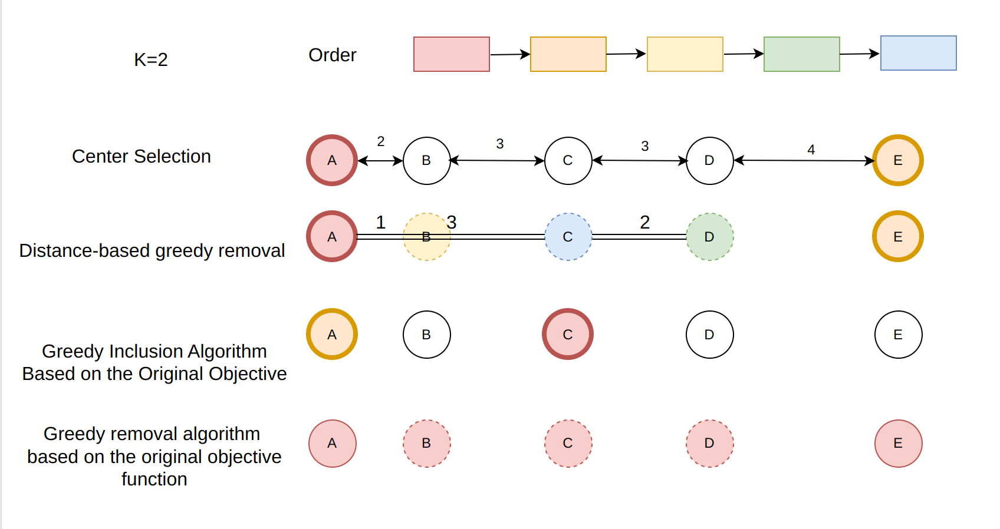

# Assignment6: 
- Zitong Huang, 12432670, Computer Science and Engineering
- Scene Reconstruction
- Prof. Feng Zheng

---

# Task 6-1

---
layout: two-cols
---

## Task 6-2

  

- After change distance between nodes, solution of these algorithm changed.

  
  

- Now greedy algorithm can find a better solution.
::right::

  
  
  

