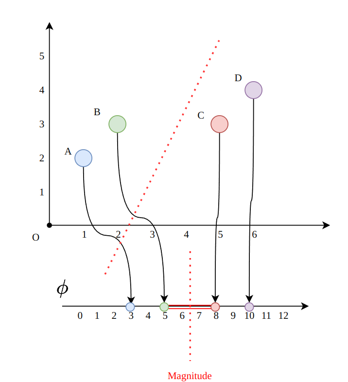

# Assignment7 : Clustering
- Zitong Huang, 12432670, Computer Science and Engineering
- Scene Reconstruction
- Prof. Feng Zheng

---
layout: two-cols
---

## Task 7-1

- Assume we need to divide a set into $n$ parts.

- First, find a function map points in initial partition to another low-dimantion feature space.

- Then, cut points in feature space by a simpler function(like average-divide, or get $n - 1$ max distance)

- Finally, map divided points back to original space.

Here is an example with map function: $\phi : s \mapsto \| s \|_1$

Points divided by function 
$$
Mag = \{x_{i, j} | d_{i, j} \in \{d_0, d_1, ..., d_n\}\}
$$
- $d_{i, j}$ is the distance between $x_i$ and $x_j$
- $d_n$ is the n-th largest distance

::right::

Here, assume we need to divide **4** point into **2** parts.

0-th largest distance is $d_{B, C} = 3$, so we devide set into $AB$ and $CD$

---
layout: two-cols
---

## Task 7-2

Assume $k = 1$. Let distance function be 
$$
d(x, y) = ||x - y||
$$
- The first row is the case with k-means.
- The second row is the case with k-medoids.

For k-means, mean value of point set $S$ is 7. Cluster center is 7.

For k-medoids, point have smallest distance to others is 9, so cluster center is 9.

Obviously, k-medoids paid less attention to outlier samples when outlier like noise occurs.

::right::
  

---
layout: two-cols
---

## Task 7-3

Consider two point sets:
$$
S_1 \sim N([0.5, 0.5], 0.5I) \\
S_2 \sim N([-0.5, -0.5], 0.5I)
$$

Red cross represented membership value of a point lower than 0.65.

Easy to find that, with the increase of m-value, the boundaries betweem clusters will be blurer.

::right::

---
layout: two-cols
---

## Task 7-4

Consider three point sets:
$$
S_1 \sim N([0, 0], I) \\
S_2 \sim N([3, 3], I) \\
S_3 \sim N([1.5, 1.5], I)
$$

- K-Means: Each point is assigned a crisp, distinct cluster label, with no overlap between clusters.
- Fuzzy C-Means: Points are assigned a membership probability for each cluster, visualized through blended colors.
- Unlike K-means, fuzzy C-means does not enforce **strict boundaries**

::right::

