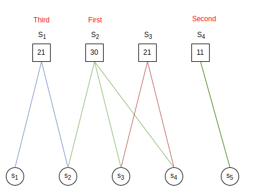

# Assignment7 : Set Cover
- Zitong Huang, 12432670, Computer Science and Engineering
- Scene Reconstruction
- Prof. Feng Zheng

---
layout: two-cols
---

## Task 8-1

For case shown in upper graph, Greedy algorithm will choose **first $S_2$, then $S_4$, and finally $S_1$**. The total cost is $w_{S_1} + w_{S_2} + w_{S_4} = 62$.

However, the best solution is 
$$
w(C) = \sum_{i \in \{1, 3, 4\}} w_{S_i} = 53
$$

As for lower graph, greedy algorithm will choose $\{S_1, S_2, S_3, S_5\}$, with $w(C) = 8.4$
However, the OPT solution is $\{S_5\}$, with $w(C^*) = 4.1$
$$
\frac{w(C)}{w(C^*)} = \frac{8.4}{4.1} \approx 2.05
$$

::right::

  

---
layout: two-cols
---

## Task 8-2 (Example 1)

Consider right example.
For the first, and each step , greedy algorithm will choose $S_1$(First step), $S_2$(Second Step), $S_3$(Third Step) or $S$ by an averge weight.

Final weight will be 

$$
w(C^*) = 4 \\
\text{When algorithm choose } S_5 \text{ in first step}
$$

And

$$
w(C) = \sum\{1, \frac{4}{3}, 2, 4\} = 8.33 \\
\text{When algorithm choose } S_5 \text{ at last}
$$

Equals to $w(C^*)H(d^*) = 4 * H(4^*)$ 

::right::
  
  

  
  

> *Middle Solution*
> 
> When $S_5$ is choosen neight first nor last, a middle solution $w(C) \models W(C^*) < w(C) < w(C^*)H(d^*)$ occurs.

---
layout: two-cols
---

## Task 8-2 (Example 2)

Consider upper example. This example directly explain how $w(C)_{worst} = H(d)$ comes.

Best weight will be directly choose $S_5$, the result will be
$$
w(C^*) = 1
$$

Similar with example before, for each step algorithm will choose $S_1$(First step), $S_2$(Second Step), $S_3$(Third Step) or $S$ by an averge weight.

when $S_5$ is choosen as the last one, algorithm will comes for its worst case, and result will be

::right::
  
  

  
  

$$
w(C) = \sum{S_1, S_2, S_3, S_4}\\
 = \sum{\{\frac{1}{4}, \frac{1}{3}, \frac{1}{2}, 1\}} = H(4*)
$$