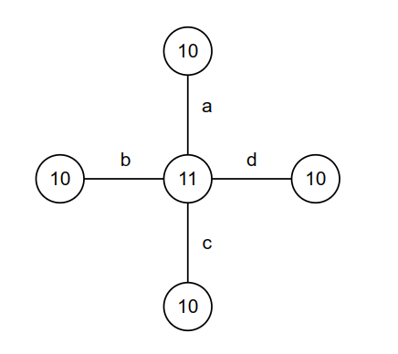
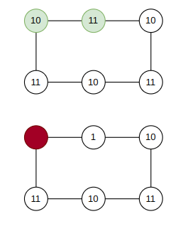
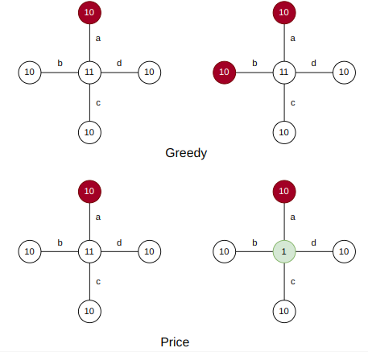

# Assignment9 : Vertex Cover Problem
- Zitong Huang, 12432670, Computer Science and Engineering
- Scene Reconstruction
- Prof. Feng Zheng

---
layout: two-cols
---

## Task 9-1

Seen as right.

What ever each edge is chosen, nodes with weight 10 will first be chosen by algorithm.

The final result will be 

$$
w(S) = 10 + 11
$$

And the optimized solution will be

$$
w(S*) = 11
$$

where $\frac{w(S)}{w(S*)} \to 2$

::right::

---
layout: two-cols
---

## Task 9-2

As shown right.

After price algorithm choose a node with weight 10, neighors' price will be cut to 1.

Thus, price algorithm will choose a node with origin weight 11.

Greedy Algorithm can process this situation better, since it always choose the node with minimum weight.

::right::

---
layout: two-cols
---

## Task 9-3

As shown right.

Greedy algorithm will choose all node, since every node has a smaller weight than the center.

Price algorithm will choose the center node after choose a 10-weight node, since after price once center-node can only undertake 1.

::right::

